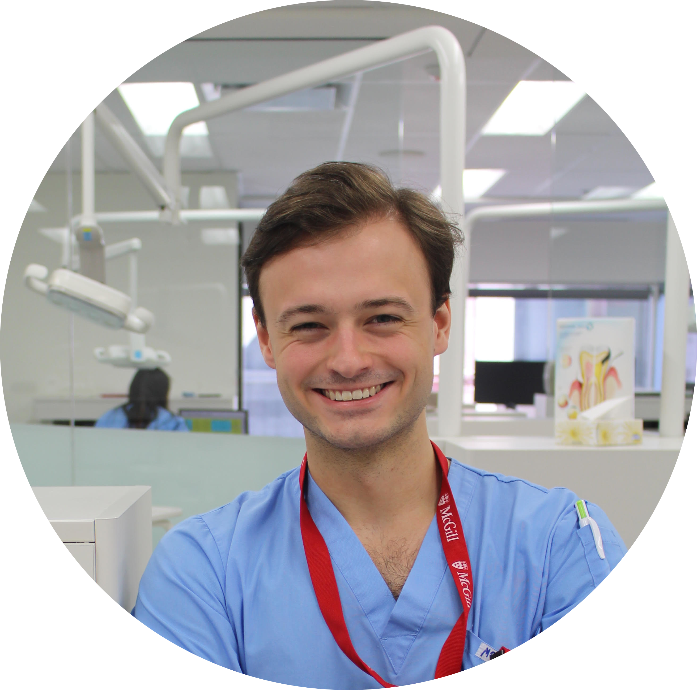

.. portfolio documentation master file, created by
   sphinx-quickstart on Sat Apr 17 14:40:13 2021.
   You can adapt this file completely to your liking, but it should at least
   contain the root `toctree` directive.

Maxime Rousseau, DMD
====================

|

.. toctree::
   :maxdepth: 2
   :caption: Contents:

About
-----

My name is Maxime Rousseau, I am a dentist doing a residency at the Montreal
Children's Hospital. I graduated as a DMD from McGill University in 2020. Over the
past few years I developed a passion for scientific research and
programming. My interests lie in how to leverage machine learning and other
computational methods in dentistry. I have a few publications and active
projects, they are listed below.

Publications
------------

- Rousseau M, Retrouvey J, Members of the Brittle Bone Disease Consortium. 2018. Osteogenesis imperfecta: potential therapeutic approaches. PeerJ 6:e5464. https://doi.org/10.7717/peerj.5464
- Rousseau et al., (2018). pfla: A Python Package for Dental Facial Analysis using Computer Vision and Statistical Shape Analysis. Journal of Open Source Software, 3(32), 855. https://doi.org/10.21105/joss.00855

Projects
--------

- `pfla <https://github.com/maxrousseau/pfla>`_: Python Facial Landmark Analysis, A python package for facial analysis of images.
- `Densys <http://www.densys.org/>`_:  Densys aims at bringing machine learning technologies to the researcher and clinicians in the various dental and medical fields. Still in early phase of development.

Contact
-------

- Email: maximerousseau08@gmail.com
- `Github <https://github.com/maxrousseau>`_
